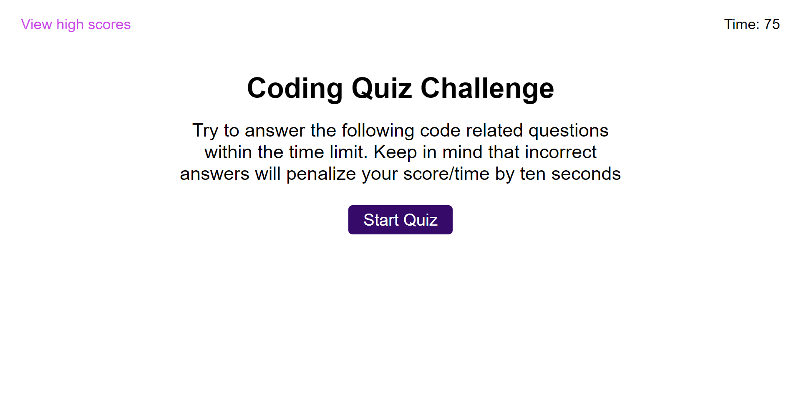

# Coding Quiz

Coding Quiz is a website create it to challenge coders with a series of questions about JavaScript coding language. the user will have 75 seconds to answer all the questions. if a question is answered incorrectly the user is penalized by subtracting time from the timer. The final score is the time left in the clock when all the questions are completed.  

The page saves a max of 5 high scores in the local storage. The option is given to the user to clear these high score if wanted. 

## Website Screenshot

## Link to Website
[Coding Quiz](https://hbbc248.github.io/code-quiz/)